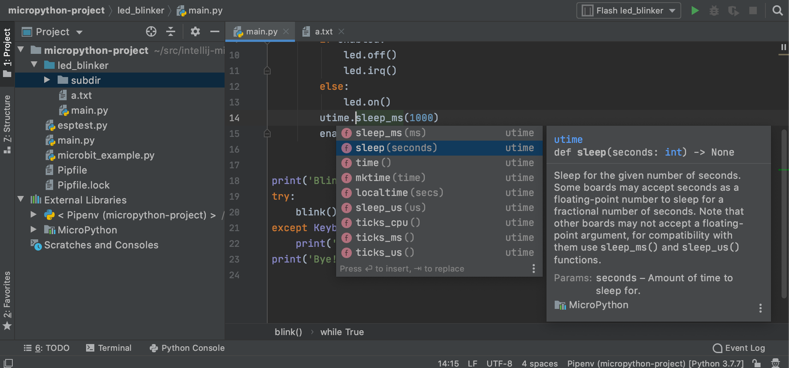
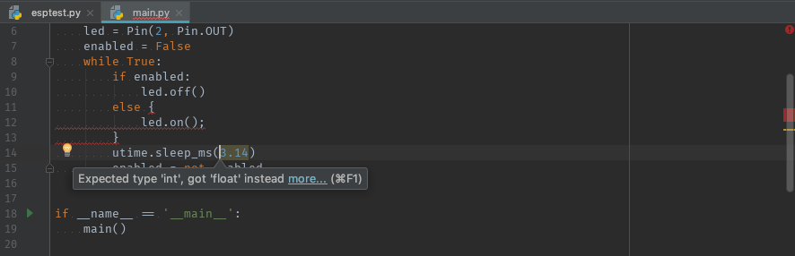
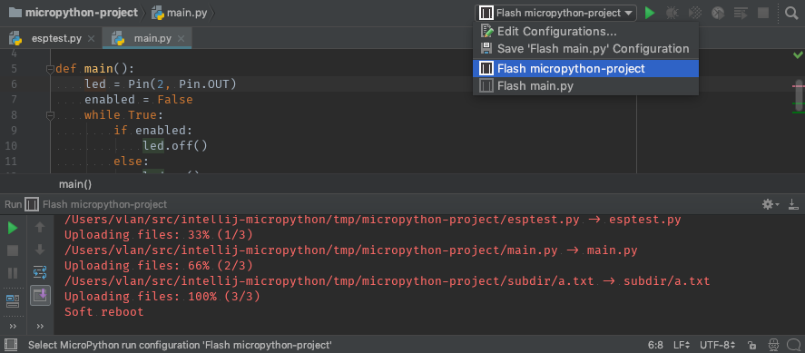
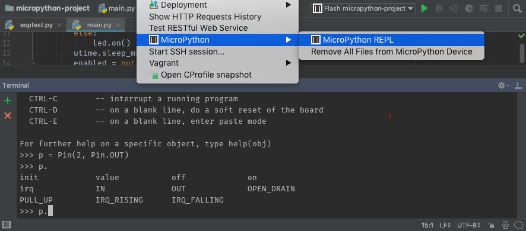
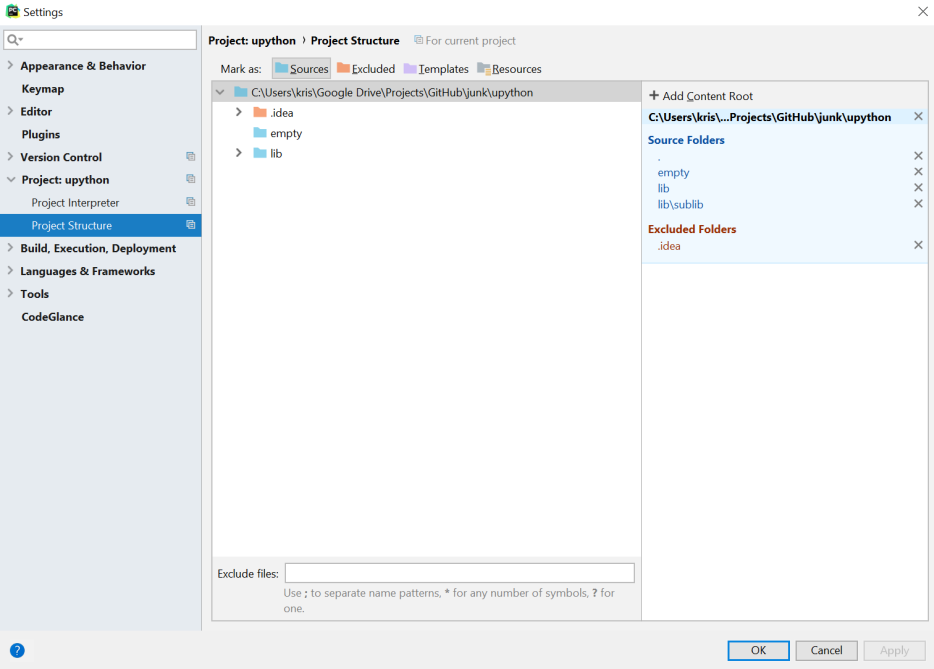
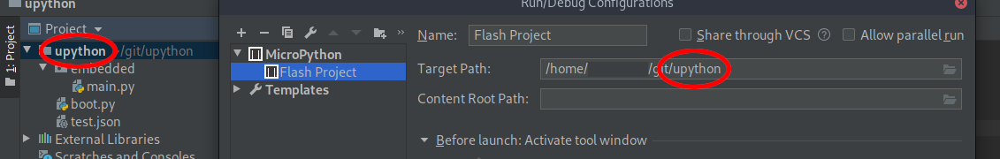
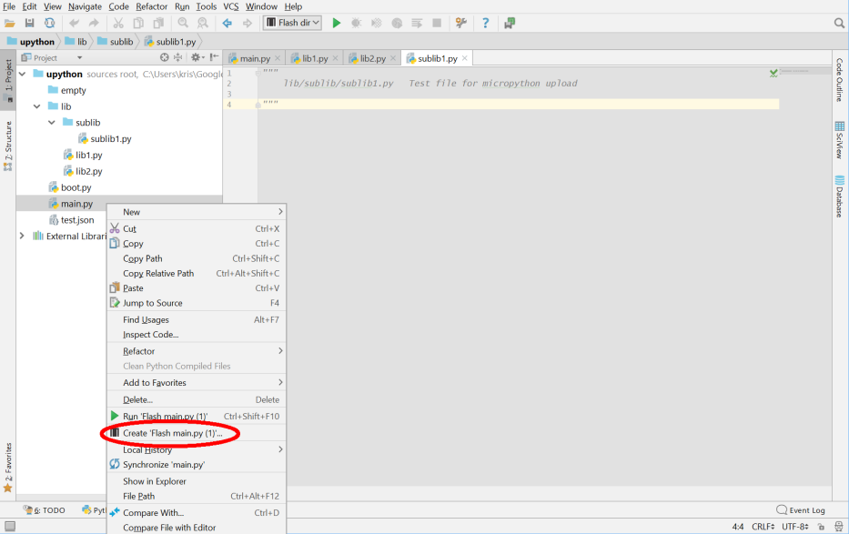
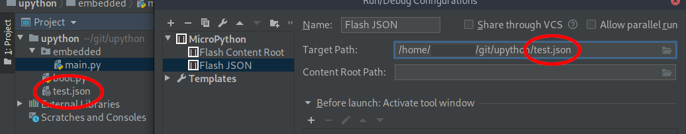

# MicroPython Plugin for IntelliJ and PyCharm

The Python code development plugin for [MicroPython](http://micropython.org/) devices in
[IntelliJ IDEA](https://www.jetbrains.com/idea/) and [PyCharm](https://www.jetbrains.com/pycharm/).

## Supported devices

The plugin supports these devices:

* [BBC Micro:bit](https://github.com/vlasovskikh/intellij-micropython/wiki/BBC-Micro%3Abit)
* [ESP8266](https://github.com/vlasovskikh/intellij-micropython/wiki/ESP8266)
* [PyBoard](https://github.com/vlasovskikh/intellij-micropython/wiki/Pyboard)

**Note:** This plugin is intended for the development, upload and execution of _Python files_ using an attached
MicroPython device. It does **not** yet support flashing the MicroPython firmware image to that device. See
[these instructions](http://micropython.org/download) flashing MicroPython firmware images to devices.

This plugin is still in its early days. It will support more MicroPython devices and more
device-specific and MicroPython-specific modules eventually. We are interested in your
contributions to the project. Feel free to open issues and send pull requests!

## Features

### Code insight for MicroPython modules

* Context-aware code completion and documentation
    * Use <kbd>Ctrl+Q</kbd> (<kbd>F1</kbd> on macOS) for quick documentation window, you can dock it permanently

      

* Syntax checking and type checking
    * The plugin checks your code while you're typing it

      

### Run code on MicroPython devices

* Flash Python files to devices
    * Use "MicroPython" run configurations to flash files or folders in <em>"Run | Edit Configurations..."</em> menu

      

* MicroPython REPL
    * Use <em>"Tools | MicroPython | MicroPython REPL"</em> menu to run a MicroPython shell on your device

      

## Requirements

* IntelliJ 2017.3+ or PyCharm 2017.3+
* Python 3.5+
    * MicroPython language version is 3.5. If you select a newer version, turn on <em>"File | Settings | Editor |
      Inspections | Python | Code compatibility inspection"</em> and add Python 3.5 to the compatibility list there
* Python plugin (IntelliJ only)
* Supported MicroPython development board with recent version of MicroPython firmware flashed to board.

## Installation

1. Install the "MicroPython" plugin from your IDE settings.

2. The setup steps differ for IntelliJ and PyCharm:
* IntelliJ: Add the MicroPython facet to a Python module in your project structure
* PyCharm: Enable MicroPython support in <em>"File | Settings | Languages & Frameworks | MicroPython"</em>

  

3. Windows Note:
* There are usually two options for project interpreter under Windows: `python.exe` and `pythonw.exe`. Make sure you
  select `python.exe` as the Project Interpreter or you will not be able to start the Micropython REPL

## Usage details

### Flash all project files

* Exclude the PyCharm <em>.idea</em> directory.
  This prevents the contents of this directory from being uploaded to the MicroPython device.

    

* Select the top level folder of the project in the path browser of <em>"Run/Debug Configurations"</em>.

    

* Name the <em>Run/Debug Configuration</em> and hit <em>OK</em> or <em>Apply</em>

### Create run configurations for individual files

* Right click on the file and select <em>"Create Flash ..."</em>

    

### Flash non-python files

* Currently non-python files do not display in the <em>"Run/Debug Configurations"</em> file picker although they do
  display in the Project Navigator.
* Non-python files can be uploaded to the board by manually typing the required filename/path components into the
  <em>"Path:"</em> dialog.
* It is easier to select a python file in the same directory as the file to be uploaded using the file picker and then
  manually edit the filename. This ensures that the path component of the file to be uploaded is correct
* Note that when flashing an entire project using the technique above, ALL files are uploaded to the device, including
  non-python files. This is the reason the <em>.idea</em> directory should be excluded from the project structure.

    

## Known Issues

* References to `pyb` module are marked as unresolved ([#16](https://github.com/vlasovskikh/intellij-micropython/issues/16))
* References to some modules from the MicroPython standard library are marked as unresolved

## Source Code

The plugin is written in Python and [Kotlin](https://kotlinlang.org/). Kotlin a new JVM language by JetBrains, the
makers of IntelliJ and PyCharm. Google recently selected Kotlin as an officially supported language for Android
development.

The steps for setting up the development environment:

1. Check out this project from GitHub
2. Create a new project from existing sources in IntelliJ 2017.3 or newer

To just run the development version use `./gradlew clean runIde` from the command line.

Contributions are welcome!

## License

The plugin is licensed under the terms of the Apache 2 license.
