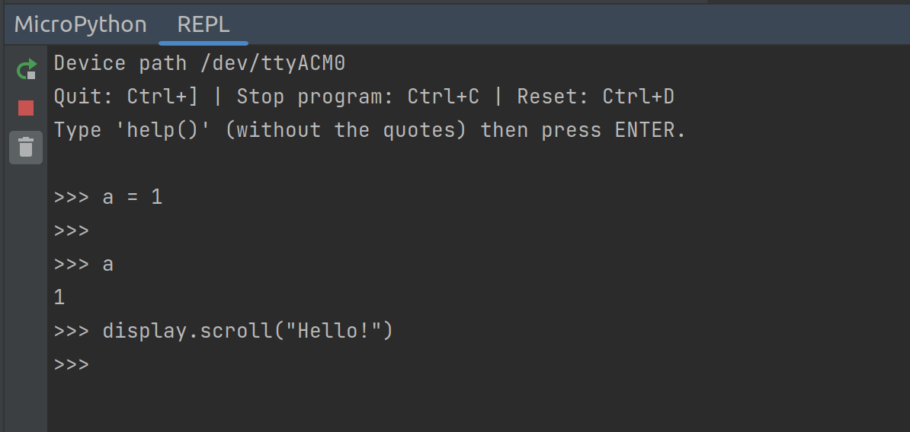

# MicroPython Plugin for PyCharm and IntelliJ

The Python code development plugin for [MicroPython](http://micropython.org/) devices in
[PyCharm](https://www.jetbrains.com/pycharm/) and [IntelliJ](https://www.jetbrains.com/idea/).

## Supported devices

The plugin supports Python development for these devices:

* [ESP8266](https://github.com/vlasovskikh/intellij-micropython/wiki/ESP8266)
* [PyBoard](https://github.com/vlasovskikh/intellij-micropython/wiki/Pyboard)
* [BBC Micro:bit](https://github.com/vlasovskikh/intellij-micropython/wiki/BBC-Micro%3Abit)
* [Raspberry Pi Pico](https://www.raspberrypi.org/products/raspberry-pi-pico/)

It will support more MicroPython devices and more device-specific and MicroPython-specific modules eventually. We are
interested in your contributions to the project. Feel free to open issues and send pull requests!

See also [the changelog](CHANGES.md) for the plugin.

## Features

### Code insight for MicroPython modules

* Context-aware code completion and documentation
    * Use <kbd>Ctrl+Q</kbd> (<kbd>F1</kbd> on macOS) for quick documentation window, you can dock it permanently

      

* Syntax checking and type checking
    * The plugin checks your code while you're typing it

      

### Run code on MicroPython devices

* Flash Python files or project directories to devices
    * Right-click on a file or directory and select <em>"Run 'Flash <your-file-name>'"</em> to flash this item to your
      connected device. If you want to flash a sub-directory to the root directory of your device, please mark this
      sub-directory as a sources root: right-click on it and select <em>"Mark Directory as | Sources Root"</em>. Its
      icon will become blue, see the screenshot.
    
      

    * You can edit your run configurations for flashing files or directories in <em>"Run | Edit Configurations..."</em>
      menu.

      

* MicroPython REPL
    * Use <em>"Tools | MicroPython | MicroPython REPL"</em> menu to run a MicroPython shell on your device. Or open 
  MicroPython REPL tool window directly

      

## Requirements

* PyCharm or IntelliJ
* Python 3.5+
    * The MicroPython language version is 3.5. If you select a newer version, turn on <em>"File | Settings | Editor |
      Inspections | Python | Code compatibility inspection"</em> and add Python 3.5 to the compatibility list there
* Python plugin (IntelliJ only)
* Supported MicroPython development board with a recent version of MicroPython firmware flashed to the board

## Installation

1. Install the "MicroPython" plugin from your IDE settings.

2. Create a new project or open an existing folder with your MicroPython code.

3. This step differs for PyCharm and IntelliJ:
    * PyCharm: Enable MicroPython support in <em>"File | Settings | Languages & Frameworks | MicroPython"</em> and
      specify the path to your MicroPython device
    * IntelliJ: Add the MicroPython facet to a Python module in your project structure and specify the path to your
      MicroPython device

    

4. Open any Python file in project. You may see a yellow bar on top of the file, notifying you that you don't
   have some packages required for communicating with your device. In this case click "Install requirements" and wait
   while the plugin downloads and installs the packages.

## Source Code

We write this plugin in Python and [Kotlin](https://kotlinlang.org/). Kotlin a new JVM language by JetBrains, the
makers of PyCharm and IntelliJ. Google recommends Kotlin as the best language for developing Android apps. If you are a
Python developer, Kotlin may be an interesting language for you to learn.

The steps for setting up the development environment:

1. Check out this project from GitHub
2. Create a new project from existing sources in IntelliJ

To just run the development version use `./gradlew clean runIde` from the command line.

Contributions are welcome!

## License

The plugin is licensed under the terms of the Apache 2 license.
